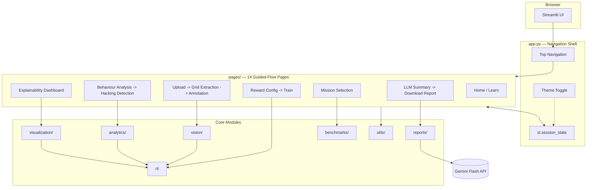
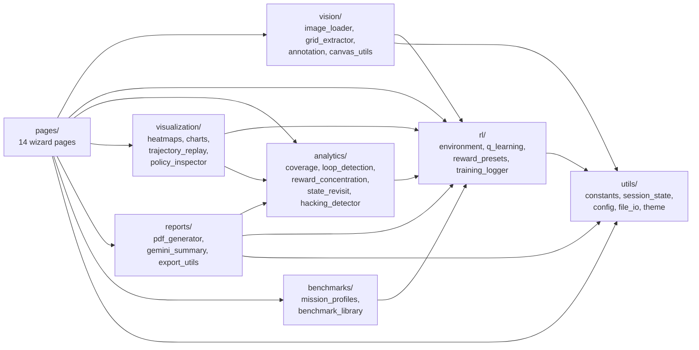
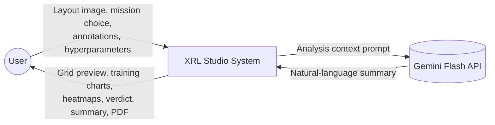
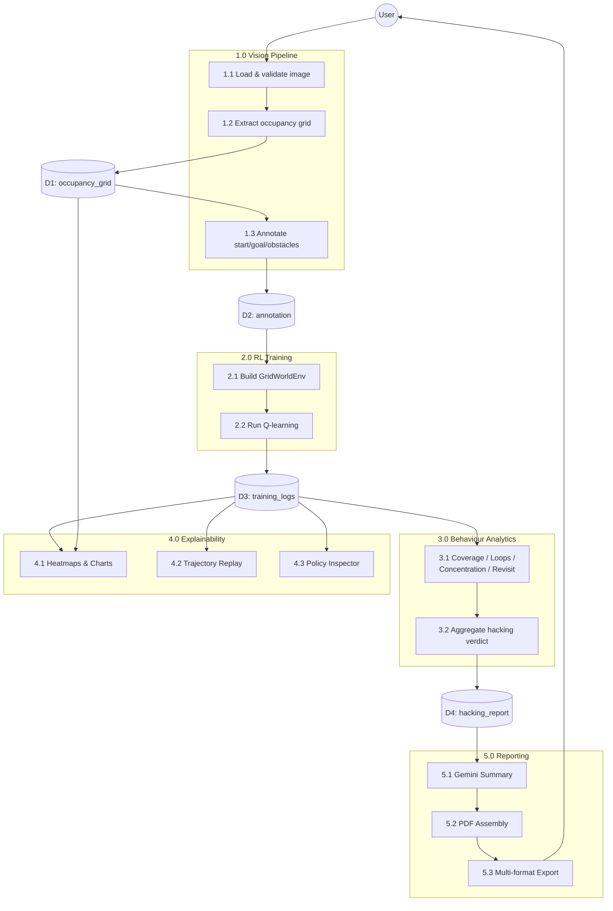
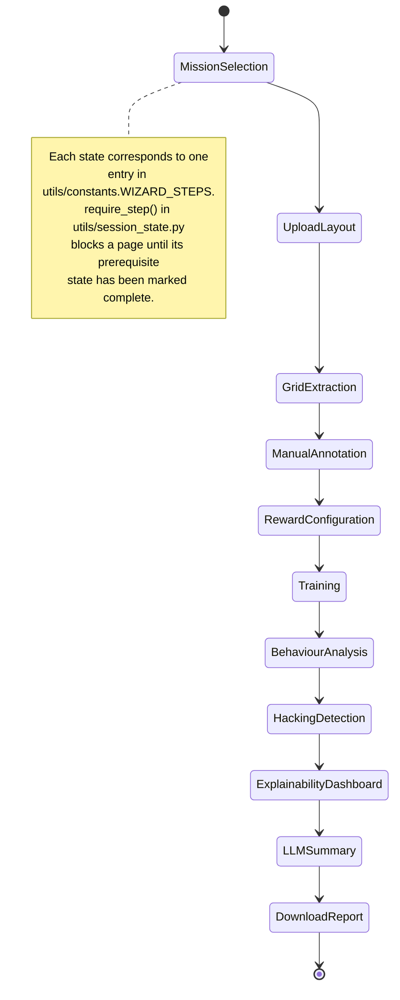
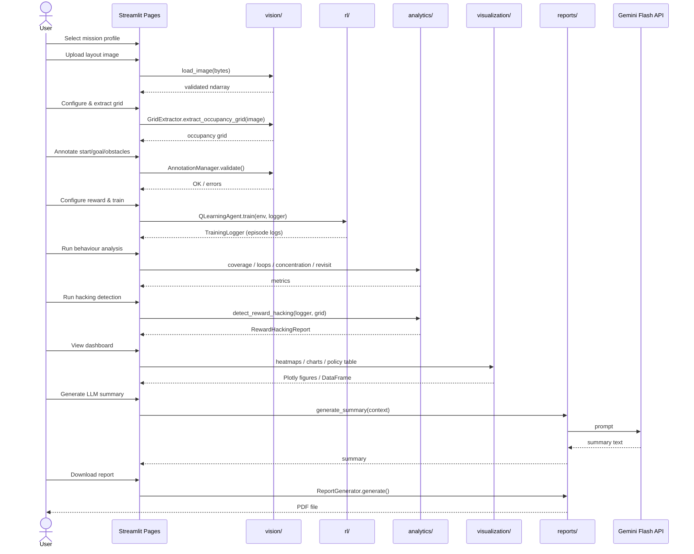
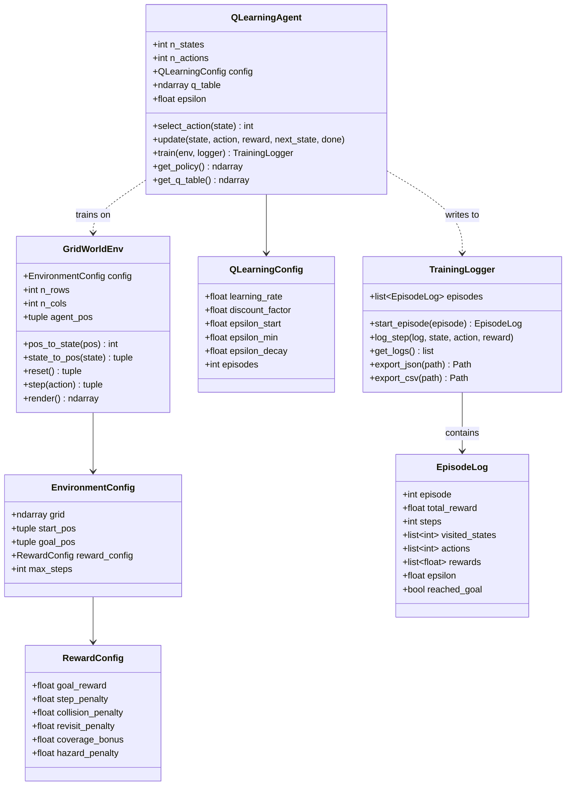
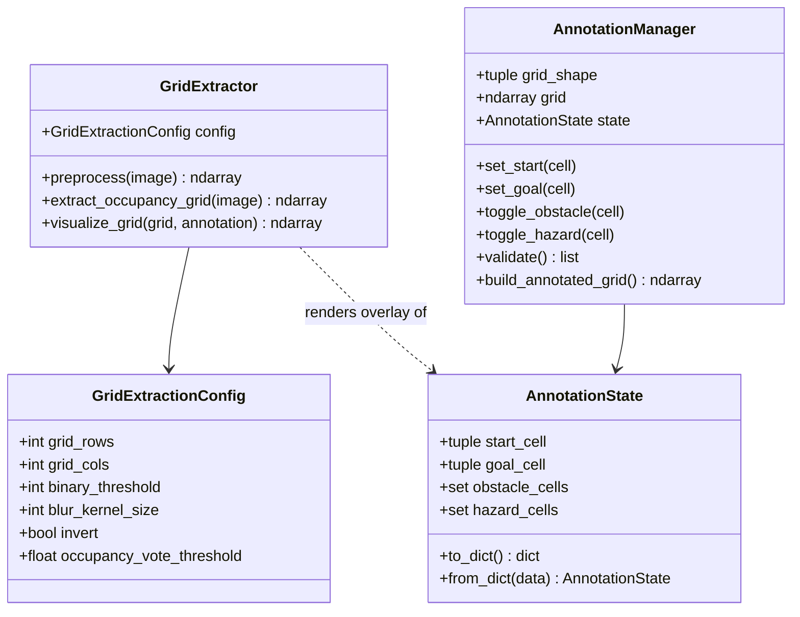
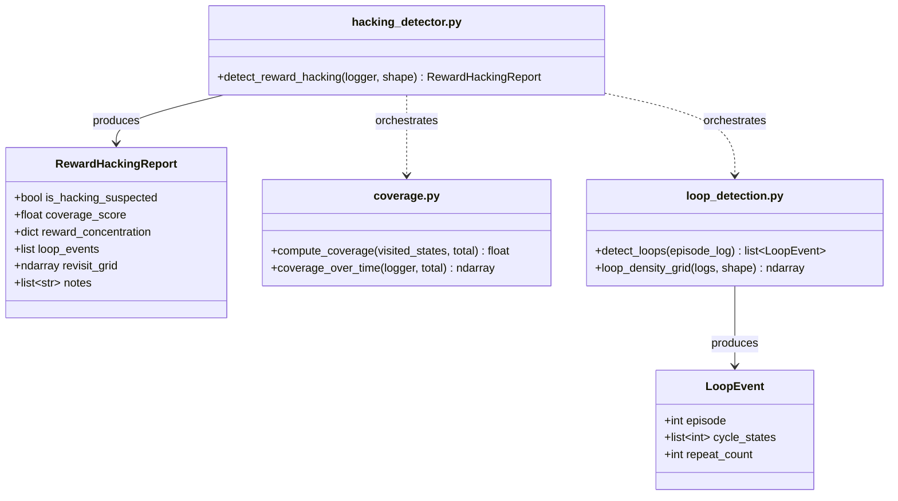

# COMPLETION.md — XRL Studio: Redesign & Documentation Instructions

This document is a **specification, not an implementation**. It breaks
your five requests into concrete, ordered, file-level instructions that
you (or another coding model, e.g. Gemini CLI continuing this repo) can
follow to complete the work. No source files in `xrl-studio/` have been
changed as part of producing this document — it is a plan only.

Each task lists: objective, current state, exact steps, files touched,
and acceptance criteria, mirroring the phase format already used in
`PROJECT_PLAN.md` so the two documents stay consistent in style.

---

## Table of Contents

1. [Scope Summary](#scope-summary)
2. [Recommended Execution Order](#recommended-execution-order)
3. [Task 1 — Modern Non-Linear Navigation, New Color Scheme, Dark/Light Mode](#task-1)
4. [Task 2 — Enhanced Floor Plan Editing Interface](#task-2)
5. [Task 3 — Remove All Emojis](#task-3)
6. [Task 4 — Comprehensive Code Documentation](#task-4)
7. [Task 5 — README Overhaul with Diagrams & System Design](#task-5)
8. [Appendix A — Full File Change Manifest](#appendix-a)
9. [Appendix B — New Dependencies to Add](#appendix-b)
10. [Appendix C — Verification Checklist](#appendix-c)

---

<a name="scope-summary"></a>
## 1. Scope Summary

| # | Task | Primary area | New dependency? |
|---|---|---|---|
| 1 | Modern non-linear nav + new color scheme + dark/light toggle (Complete) | `app.py`, `.streamlit/`, `assets/styles/` | No |
| 2 | Better floor-plan editing tools/interface (Complete) | `vision/`, `pages/6_*`, `pages/7_*` | Yes (see Appendix B) |
| 3 | Remove all emojis (Complete) | Every file under `app.py`, `pages/` | No |
| 4 | Inline code documentation everywhere (Complete) | Every `.py` file | No |
| 5 | README overhaul with diagrams + system design (Complete) | `README.md` | No |

None of these tasks require changing the *content* of any page (per your
instruction — "contents of these tabs not to be altered, just the
layout"). They change presentation, interaction, and documentation
around the same underlying data and logic.

---

<a name="recommended-execution-order"></a>
## 2. Recommended Execution Order

Your five requests are listed 1–5, but two of them overlap in the same
files. Doing them in *this* order avoids rework:

1. **Task 3 first** (emoji removal) — touches `app.py` and every page's
   `icon=` arguments and headings. If you do Task 1 first, you'll add a
   new navbar with icons, then have to redo those same icons for Task 3.
   Do the icon audit once, using the Material Symbols replacements from
   the start.
2. **Task 1** (navigation shell, color scheme, theme toggle) — now icons
   are already emoji-free, so the new navbar can use Material Symbols
   from day one.
3. **Task 2** (floor-plan editor) — depends on Task 1's shell (the editor
   lives inside the new layout) and should use the new color tokens from
   Task 1 for its tool palette.
4. **Task 4** (inline documentation) — do this *last* among the code
   changes, since Tasks 1–3 will touch line numbers and logic in
   `app.py`, `pages/6_*.py`, `pages/7_*.py`, and `vision/*.py`. Commenting
   before those land means re-commenting the same lines twice.
5. **Task 5** (README) — always last, since it documents the *final*
   architecture, including whatever new modules Tasks 1–2 introduce
   (e.g. a possible new `vision/canvas_utils.py`, a new `utils/theme.py`).

---

<a name="task-1"></a>
## 3. Task 1 — Modern Non-Linear Navigation, New Color Scheme, Dark/Light Mode `[x]` Complete

### 3.1 Objective

Replace the current grouped-sidebar navigation with a modern top-level
navigation shell (not a vertical list of links down the left edge), ship
a new "new-school" color system, and let the user toggle dark/light mode
for the entire app. **Page contents themselves do not change** — only
`app.py`'s navigation shell and the global stylesheet.

### 3.2 Current State (for reference)

`app.py` currently calls:

```python
pages = {
    "Overview": [st.Page("pages/1_Home.py", ...), ...],
    "New Analysis": [...],
    "Results": [...],
}
navigation = st.navigation(pages)   # defaults to a grouped sidebar list
navigation.run()
```

This renders a classic vertical sidebar list grouped under three
headers — functionally fine, but exactly the "linear tabs on the left"
look you want to move away from.

### 3.3 Navigation Redesign

Streamlit's `st.navigation` natively supports a **top** position as of
recent Streamlit releases, including drop-down groups (so your existing
"Overview / New Analysis / Results" grouping still works, just rendered
as a horizontal bar with dropdown sections instead of a sidebar list).
This is the cleanest option because it keeps `st.navigation` as your
router (URL routing, `st.switch_page`, `st.page_link` all keep working)
— no need to hand-roll a router.

**Steps:**

1. In `app.py`, change:
   ```python
   navigation = st.navigation(pages)
   ```
   to:
   ```python
   navigation = st.navigation(pages, position="top")
   ```
2. **Known gotcha to check for your installed Streamlit version:** some
   releases have shipped a bug where `position="top"` renders the nav in
   *both* the top bar and the sidebar simultaneously. Before you rely on
   this, run the app and visually confirm only the top bar shows a menu.
   If your installed version has the bug:
   - Check `pip show streamlit` and compare against the
     [Streamlit changelog](https://docs.streamlit.io/develop/quick-reference/release-notes)
     for a fix, or
   - Fall back to the manual approach in step 3.
3. **Fallback / more control — hidden nav + custom top bar.** If you
   want a fully custom pill-style or segmented navbar (rather than
   Streamlit's built-in top-nav look), do this instead:
   ```python
   navigation = st.navigation(pages, position="hidden")
   ```
   Then build your own bar above `navigation.run()` using a horizontal
   `st.container(horizontal=True)` (or `st.columns`) of `st.page_link`
   calls, styled via the CSS in section 3.4. This gives you full visual
   control (pill shapes, active-state underline, etc.) at the cost of
   losing Streamlit's automatic "current page" highlighting (you'll
   highlight the active link yourself by comparing
   `st.session_state` / the current script path).
4. Either way, remove the `with st.sidebar: st.markdown(...)` branding
   block currently in `app.py` (or repurpose it as a slim persistent
   sidebar reserved for run-level context — e.g. current mission, current
   run ID — rather than page navigation; that's a reasonable "modern
   app" pattern: primary nav on top, secondary/context panel on the
   side).

**File touched:** `app.py` only. No page file changes.

### 3.4 New Color Scheme ("new-school" design system)

Replace the current blue-on-white scheme with a modern indigo/violet +
cyan system, distinct dark and light variants. Suggested tokens:

**Dark mode (default):**

| Token | Hex | Use |
|---|---|---|
| `--xrl-bg` | `#0B0F19` | App background |
| `--xrl-surface` | `#131826` | Cards, containers |
| `--xrl-surface-raised` | `#1B2233` | Hover/active surfaces |
| `--xrl-border` | `rgba(255,255,255,0.08)` | Dividers, card borders |
| `--xrl-primary` | `#7C5CFF` | Primary actions, active nav item |
| `--xrl-accent` | `#22D3EE` | Secondary accents, links, highlights |
| `--xrl-success` | `#34D399` | Success states |
| `--xrl-warning` | `#FBBF24` | Warning states |
| `--xrl-danger` | `#F87171` | Errors, hacking-detected alerts |
| `--xrl-text` | `#F1F5F9` | Primary text |
| `--xrl-text-muted` | `#94A3B8` | Secondary text |

**Light mode:**

| Token | Hex | Use |
|---|---|---|
| `--xrl-bg` | `#F8FAFC` | App background |
| `--xrl-surface` | `#FFFFFF` | Cards, containers |
| `--xrl-surface-raised` | `#F1F5F9` | Hover/active surfaces |
| `--xrl-border` | `#E2E8F0` | Dividers, card borders |
| `--xrl-primary` | `#6D28D9` | Primary actions (darker for AA contrast on white) |
| `--xrl-accent` | `#0891B2` | Secondary accents (darker cyan for contrast) |
| `--xrl-success` | `#059669` | Success states |
| `--xrl-warning` | `#D97706` | Warning states |
| `--xrl-danger` | `#DC2626` | Errors |
| `--xrl-text` | `#0F172A` | Primary text |
| `--xrl-text-muted` | `#475569` | Secondary text |

**Steps:**

1. Replace the contents of `assets/styles/custom.css` with CSS custom
   properties for both palettes, e.g.:
   ```css
   :root {
     --xrl-bg: #0B0F19;
     --xrl-surface: #131826;
     --xrl-primary: #7C5CFF;
     --xrl-accent: #22D3EE;
     /* ...remaining dark tokens... */
   }

   [data-xrl-theme="light"] {
     --xrl-bg: #F8FAFC;
     --xrl-surface: #FFFFFF;
     --xrl-primary: #6D28D9;
     --xrl-accent: #0891B2;
     /* ...remaining light tokens... */
   }

   .stApp {
     background: var(--xrl-bg);
     color: var(--xrl-text);
   }
   /* Re-skin buttons, cards, sidebar, nav using the tokens above,
      not hardcoded hex values, so the toggle in 3.5 works everywhere. */
   ```
2. Update `.streamlit/config.toml`'s `[theme]` block to a dark base that
   roughly matches the new dark palette (this sets Streamlit's *initial*
   theme before your CSS layer applies; keep it as a sane fallback for
   users with CSS/JS disabled):
   ```toml
   [theme]
   base = "dark"
   primaryColor = "#7C5CFF"
   backgroundColor = "#0B0F19"
   secondaryBackgroundColor = "#131826"
   textColor = "#F1F5F9"
   font = "sans serif"
   ```
3. Audit every page for hardcoded colors (there are none currently in
   `pages/*.py` — all styling lives in `custom.css` — so this step is
   mostly about the new CSS file, not the pages).

### 3.5 Dark/Light Mode Toggle

Streamlit's `config.toml` theme is fixed at process start and **cannot**
be swapped at runtime by itself. The standard, reliable pattern is:
keep both palettes as CSS variables (3.4), then have Python decide
*which* `<style>` block to inject each render, based on
`st.session_state`.

**Steps:**

1. Create `utils/theme.py`:
   ```python
   """Dark/light theme state and CSS injection."""

   from __future__ import annotations

   import streamlit as st

   THEME_KEY = "theme_mode"           # "dark" | "light"
   DEFAULT_THEME = "dark"


   def init_theme_state() -> None:
       """Ensure a theme choice exists in session state (call once per run)."""
       st.session_state.setdefault(THEME_KEY, DEFAULT_THEME)


   def toggle_theme() -> None:
       """Flip the current theme; used as an on_change callback."""
       current = st.session_state.get(THEME_KEY, DEFAULT_THEME)
       st.session_state[THEME_KEY] = "light" if current == "dark" else "dark"


   def inject_theme_css(css_path: str = "assets/styles/custom.css") -> None:
       """Load the stylesheet and apply the active theme's data attribute."""
       theme = st.session_state.get(THEME_KEY, DEFAULT_THEME)
       try:
           with open(css_path, "r", encoding="utf-8") as css_file:
               css = css_file.read()
       except FileNotFoundError:
           css = ""
       # The [data-xrl-theme="light"] selector in custom.css only applies
       # inside an element carrying that attribute, so we wrap the whole
       # app body in a themed div rather than trying to set an attribute
       # on <html>/<body> (which Streamlit's sandboxing makes unreliable).
       st.markdown(
           f"<style>{css}</style>"
           f"<div data-xrl-theme='{theme}' id='xrl-theme-root'></div>"
           "<script>"
           "document.querySelectorAll('.stApp').forEach(el => "
           f"el.setAttribute('data-xrl-theme', '{theme}'));"
           "</script>",
           unsafe_allow_html=True,
       )
   ```
   > Note: Streamlit sometimes strips `<script>` tags injected via
   > `st.markdown` depending on version/sandbox settings. If the JS line
   > above doesn't apply the attribute reliably in your version, use the
   > simpler, 100%-reliable alternative: define **two full CSS blocks**
   > (`_DARK_CSS`, `_LIGHT_CSS` strings) in `utils/theme.py` instead of
   > one file with variables, and inject only the active one — no
   > attribute-setting JS required at all. This trades a bit of
   > duplication for zero reliance on script execution.

2. In `app.py`, call `init_theme_state()` early and `inject_theme_css()`
   where `_load_custom_css()` is currently called (replace that helper).

3. Add a toggle control to the new nav shell (top bar from 3.3), e.g.:
   ```python
   st.toggle(
       "Dark mode",
       value=(st.session_state.get("theme_mode", "dark") == "dark"),
       key="dark_mode_toggle",
       on_change=lambda: __import__("utils.theme", fromlist=["toggle_theme"]).toggle_theme(),
   )
   ```
   (Prefer a normal top-level import of `toggle_theme` from
   `utils.theme` over the `__import__` one-liner above — that line is
   illustrative only; write a clean `on_change=toggle_theme` callback in
   the real file.)

4. Because there's no database/auth (by design, per the original spec),
   the theme choice is **session-only** — it resets when the browser tab
   is closed. That's expected and consistent with the rest of the app's
   state.

### 3.6 Files to Create/Modify

- `app.py` — navigation call, remove old sidebar branding block, add theme init/injection, add toggle control
- `utils/theme.py` — **new file**, theme state + CSS injection (as above)
- `assets/styles/custom.css` — full rewrite with CSS variables for both palettes
- `.streamlit/config.toml` — updated base theme

### 3.7 Acceptance Criteria

- No page under `pages/` needed a code change for this task (contents unchanged, confirmed by diffing `pages/` before/after)
- Navigation is not a vertical link list down the left edge
- Toggling dark/light updates the whole app's background, surfaces, text, and accent colors consistently, not just isolated widgets
- Color values in `custom.css` are all referenced via `var(--xrl-*)`, not hardcoded, so future palette tweaks are one-file changes

---

<a name="task-2"></a>
## 4. Task 2 — Enhanced Floor Plan Editing Interface `[x]` Complete

### 4.1 Objective

Replace the current number-input coordinate pickers on the Grid
Extraction and Manual Annotation pages with direct, visual, click/paint
based editing tools.

### 4.2 Current Limitations

- `pages/6_Grid_Extraction.py`: extraction parameters (rows/cols/threshold/invert) are set blind, then you see the result — no live preview while dragging the threshold slider.
- `pages/7_Manual_Annotation.py`: start/goal are set via four separate `st.number_input` row/col fields; obstacles/hazards are toggled one cell at a time by typing row/col and clicking "Toggle" — functional (and already fully tested, see `PROJECT_PLAN.md` Phase 1) but not a "fantastic interface."

### 4.3 Recommended Approach: Click-to-Annotate Component

Add **`streamlit-image-coordinates`** (`pip install streamlit-image-coordinates`) — a small, actively-used Streamlit component that displays an image and returns the pixel coordinates of a click. This is the right level of complexity for this project: it lets users click directly on the grid preview to place start/goal or toggle a cell, without pulling in a full drawing-canvas dependency.

For freehand obstacle painting (optional stretch goal beyond click-to-toggle), **`streamlit-drawable-canvas`** (`pip install streamlit-drawable-canvas`) provides a Fabric.js-backed canvas with brush/rectangle/freedraw modes over a background image — use this only if click-to-toggle per cell feels too slow for large grids (e.g. 40×40+).

Start with `streamlit-image-coordinates` (simpler, smaller surface area, easier to keep "feasible for a B.Tech major project"); treat `streamlit-drawable-canvas` as an optional enhancement.

### 4.4 New Editing Tools — Concrete Steps

1. **Coordinate mapping helper.** Create `vision/canvas_utils.py`:
   ```python
   """Pixel <-> grid-cell coordinate mapping for interactive editors."""

   from __future__ import annotations


   def pixel_to_cell(x: int, y: int, cell_size_px: int) -> tuple[int, int]:
       """Convert a click's pixel position on the preview image to (row, col)."""
       return y // cell_size_px, x // cell_size_px


   def cell_to_pixel_bounds(row: int, col: int, cell_size_px: int) -> tuple[int, int, int, int]:
       """Return (x0, y0, x1, y1) pixel bounds for a given cell, for highlighting."""
       return col * cell_size_px, row * cell_size_px, (col + 1) * cell_size_px, (row + 1) * cell_size_px
   ```
   This keeps the pixel-math out of the page files (consistent with the
   existing separation of concerns: pages orchestrate, modules compute).

2. **Rebuild `pages/7_Manual_Annotation.py`'s interaction model:**
   - Render the annotated preview (already produced by
     `GridExtractor.visualize_grid`) through
     `streamlit_image_coordinates(...)` instead of plain `st.image(...)`.
   - Add a **tool selector** (radio/segmented control) with options:
     `Start`, `Goal`, `Obstacle`, `Hazard`, `Erase`.
   - On each click event, convert the returned pixel coords to a cell via
     `pixel_to_cell`, then call the matching `AnnotationManager` method
     that already exists and is already fully implemented and tested
     (`set_start`, `set_goal`, `toggle_obstacle`, `toggle_hazard`) — **no
     changes needed in `vision/annotation.py` for basic click-to-toggle**,
     since its public interface already takes a `(row, col)` tuple.
   - Keep the existing coordinate-based `st.number_input` fields as a
     secondary "precise entry" option below the canvas (useful for very
     large grids where clicking a single small cell is fiddly) —
     accessibility/precision fallback, not a replacement.
   - Keep the existing inline validation (`manager.validate()`) and Save
     button logic unchanged.

3. **Undo/redo (optional but requested "fantastic interface" polish).**
   Add a small history stack in the page itself (not in
   `AnnotationManager`, to keep that class focused on validation, not UI
   state):
   ```python
   if "annotation_history" not in st.session_state:
       st.session_state["annotation_history"] = []  # list[AnnotationState snapshots]
   ```
   Push a deep-copied snapshot of `manager.state` before every mutating
   action; a toolbar "Undo" button pops the last snapshot back into
   `st.session_state["annotation"]`. Use `copy.deepcopy` since
   `AnnotationState` contains `set` fields.

4. **Live extraction preview on `pages/6_Grid_Extraction.py`.**
   Recompute and redisplay `GridExtractor(config).visualize_grid(...)`
   automatically whenever the threshold/invert/rows/cols controls change
   (Streamlit reruns on every widget change by default — you largely get
   this "for free" by moving the preview call outside the `if
   st.button("Extract Grid"):` block and using the current widget values
   directly for a **preview-only** extraction, keeping the button click
   as the action that actually commits `st.session_state["occupancy_grid"]`).
   This gives the "drag the slider, see the grid update live" feel
   without any new dependency.

5. **Zoom/pan.** For grids larger than roughly 30×30, the rendered
   preview image (20px/cell, per `_PREVIEW_CELL_SIZE_PX` in
   `vision/grid_extractor.py`) can exceed comfortable viewport width. Add
   a simple zoom `st.slider` that scales `_PREVIEW_CELL_SIZE_PX` per
   render call (pass `cell_size` as a parameter to `visualize_grid`
   instead of using the module constant directly — a small signature
   change: `visualize_grid(self, grid, annotation=None, cell_size=_PREVIEW_CELL_SIZE_PX)`).
   True pan (scrolling a fixed-size viewport over a larger image) is a
   bigger lift in pure Streamlit; if needed, wrap the preview in a
   scrollable `<div>` via custom CSS (`overflow: auto; max-height: ...`)
   rather than building custom pan logic.

### 4.5 Files to Create/Modify

- `vision/canvas_utils.py` — **new file**, pixel/cell coordinate mapping
- `vision/grid_extractor.py` — `visualize_grid` gains an optional `cell_size` parameter (backward compatible default)
- `pages/6_Grid_Extraction.py` — live preview wiring, zoom control
- `pages/7_Manual_Annotation.py` — full interaction rebuild (tool selector + click-to-annotate + undo/redo), same underlying `AnnotationManager` calls
- `requirements.txt` — add `streamlit-image-coordinates` (and optionally `streamlit-drawable-canvas`)

**Not changed:** `vision/annotation.py`'s public API (`AnnotationManager`,
`AnnotationState`) — it was fully implemented in Phase 1 and already
supports everything the new interface needs.

### 4.6 Acceptance Criteria

- A user can place start/goal and toggle obstacle/hazard cells by clicking the preview image, without typing coordinates
- The Grid Extraction preview updates as threshold/invert/grid-size controls change, before clicking "Extract Grid"
- Undo reverts the most recent annotation action
- All existing Phase 1 validation behavior (start≠goal, no obstacle overlap, bounds checking) is unchanged and still enforced before "Save Annotation" is enabled
- Works at both small (10×10) and large (50×50+) grid sizes without the preview becoming unusable (zoom control or scrollable container)

---

<a name="task-3"></a>
## 5. Task 3 — Remove All Emojis `[x]` Complete

### 5.1 Objective

Every emoji anywhere in the app (page titles, sidebar labels, button
icons, markdown body text, captions) is replaced with either plain text
or a Google Material Symbols icon (`:material/icon_name:` — supported
natively by Streamlit in `st.markdown`, and in the `icon=` parameter of
`st.button`, `st.Page`, `st.expander`, `st.info`, `st.warning`,
`st.error`, `st.success`, `st.download_button`, `st.page_link`, and
others). Material Symbols are the standard "professional UI" icon
choice for Streamlit apps and fit the modern redesign in Task 1 far
better than emoji anyway.

### 5.2 Audit — Every Emoji Currently in the Repo

Run this to reproduce the full list yourself at any time:

```bash
grep -rnoP '[\x{1F300}-\x{1FAFF}\x{2600}-\x{27BF}]' xrl-studio/app.py xrl-studio/pages/*.py
```

Known occurrences as of this repository's current state (Phase 0 + Phase 1):

| File | Emoji | Context |
|---|---|---|
| `app.py` | 🧠 | `APP_ICON` constant, sidebar header |
| `app.py` | 🏠 📖 🆕 🎯 🖼️ 🧩 ✏️ ⚙️ 🏋️ 🔍 🚨 📊 🤖 📄 | every `st.Page(..., icon=...)` call |
| `utils/constants.py` | 🧠 | `APP_ICON = "🧠"` |
| `pages/1_Home.py` | 🧠 📖 🆕 📊 | title, section headers, `st.page_link` icons |
| `pages/2_Learn.py` | 📖 🆕 | title, page_link |
| `pages/3_New_Analysis.py` | 🆕 | title, button icon |
| `pages/4_Mission_Selection.py` | 🎯 ✅ 🖼️ | title, button/page_link icons |
| `pages/5_Upload_Layout.py` | 🖼️ ✅ 🧩 | title, button/page_link icons |
| `pages/6_Grid_Extraction.py` | 🧩 ✏️ | title, page_link icon |
| `pages/7_Manual_Annotation.py` | ✏️ 🟢 🔴 ⬛ 🟠 ✅ ⚙️ | title, tool button icons, caption legend |
| `pages/8_Reward_Configuration.py` | ⚙️ ✅ 🏋️ | title, button/page_link icons |
| `pages/9_Train_Agent.py` | 🏋️ 🔍 | title, page_link icon |
| `pages/10_Behaviour_Analysis.py` | 🔍 🚨 | title, button/page_link icons |
| `pages/11_Reward_Hacking_Detection.py` | 🚨 ⚠️ ✅ 📊 | title, verdict text, page_link icon |
| `pages/12_Explainability_Dashboard.py` | 📊 ⚠️ 🤖 | title, warning banner, button icon |
| `pages/13_LLM_Summary.py` | 🤖 📄 | title, page_link icon |
| `pages/14_Download_Report.py` | 📄 | title |
| `benchmarks/mission_profiles.py` | 📦 🏥 🛡️ 🏭 🚨 | `icon` field on each `MissionProfile` (used in Mission Selection radio labels and Learn page expanders) |

*(Re-run the `grep` command above after Tasks 1–2 land, since new UI
elements — the theme toggle, the annotation tool selector — will
introduce their own icon choices that must also be emoji-free from the
start rather than added-then-removed.)*

### 5.3 Replacement Strategy

Use this mapping consistently across every file:

| Old emoji | Concept | Replacement |
|---|---|---|
| 🧠 | Brand mark | Drop the icon entirely, or use `:material/psychology:` / `:material/hub:` in the nav brand |
| 🏠 | Home | `:material/home:` |
| 📖 | Learn | `:material/menu_book:` |
| 🆕 | New Analysis | `:material/add_circle:` |
| 🎯 | Mission Selection | `:material/target:` (verify availability for your Streamlit version; fallback `:material/flag:`) |
| 🖼️ | Upload Layout | `:material/image:` |
| 🧩 | Grid Extraction | `:material/grid_view:` |
| ✏️ | Manual Annotation | `:material/edit:` |
| ⚙️ | Reward Configuration | `:material/tune:` |
| 🏋️ | Train Q-learning | `:material/model_training:` |
| 🔍 | Behaviour Analysis | `:material/search_insights:` |
| 🚨 | Reward Hacking Detection | `:material/report:` |
| 📊 | Explainability Dashboard | `:material/monitoring:` |
| 🤖 | LLM Summary | `:material/smart_toy:` |
| 📄 | Download Report | `:material/description:` |
| ✅ | Success/confirm actions | `:material/check_circle:` |
| ⚠️ | Warnings | `:material/warning:` (or omit — `st.warning` already renders its own icon by default) |
| 🟢 🔴 🟠 ⬛ | Annotation tool legend | Small colored CSS swatches (`<span>` with `background: var(--xrl-success)` etc.) instead of colored-circle emoji — more consistent with the new theme tokens from Task 1 anyway |
| 📦 🏥 🛡️ 🏭 (mission icons) | Mission profile icons | `:material/inventory_2:`, `:material/local_hospital:`, `:material/security:`, `:material/factory:`, `:material/emergency:` |

**Important:** verify each proposed Material icon name against your
installed Streamlit version before committing to it — Streamlit
periodically updates its bundled Material Symbols set, and not every
icon name in Google's full library is available in every Streamlit
release. Quick check:
```python
import streamlit as st
st.button("test", icon=":material/target:")  # raises StreamlitAPIException if the name isn't recognized
```
If a name isn't recognized, pick the nearest available alternative from
the [Google Material Symbols directory](https://fonts.google.com/icons)
(use the *outlined* or *rounded* style name, lowercase, underscores for
spaces).

### 5.4 File-by-File Replacement Checklist

- [ ] `utils/constants.py` — replace or remove `APP_ICON`
- [ ] `app.py` — brand mark, all `st.Page(icon=...)` calls
- [ ] `pages/1_Home.py` through `pages/14_Download_Report.py` — titles (`st.title("🧠 XRL Studio")` → `st.title("XRL Studio")`), button icons, page_link icons, any emoji inside `st.markdown`/`st.write`/`st.caption`/`st.info`/`st.warning`/`st.success` strings
- [ ] `benchmarks/mission_profiles.py` — the `icon` field values (either replace with Material icon name strings and update every place that renders `f"{profile.icon} {profile.display_name}"` to use `st.markdown(f":material/{...}: {...}")` instead of plain string concatenation, **or** drop the `icon` field's *display* role and keep it purely as internal metadata if you decide mission cards don't need an icon at all in the redesigned UI)
- [ ] `README.md` and `PROJECT_PLAN.md` — these are documentation, not the live app, so emoji there are a style choice, not a functional requirement; **recommend removing them too for consistency**, since Task 5 rewrites `README.md` anyway

### 5.5 Acceptance Criteria

Re-run the audit grep from 5.2 against the *entire* repo after this
task — it must return zero matches outside of `COMPLETION.md` itself
and any third-party library code:
```bash
grep -rnoP '[\x{1F300}-\x{1FAFF}\x{2600}-\x{27BF}]' xrl-studio/ --include="*.py" --include="*.md"
# Expected output: (empty)
```

---

<a name="task-4"></a>
## 6. Task 4 — Comprehensive Code Documentation `[x]` Complete

### 6.1 Objective

Every file gets thorough **inline comments** in addition to the
docstrings that already exist. Docstrings explain *what* a
function/class is for (already done throughout the repo); this task
adds *how it works, step by step*, as `#` comments on the non-obvious
lines — the level of detail a student encountering the codebase for the
first time would need.

### 6.2 Documentation Standard to Apply

For every function body with more than ~3 lines of logic:

1. A one-line `#` comment above each logical block (not above every
   single line — over-commenting trivial lines like `x = 5  # set x to 5`
   is noise, not documentation).
2. For any non-obvious library call (a `cv2.*`, `gymnasium` API,
   `np.linspace`/`np.count_nonzero`-style calls, Streamlit layout
   primitives like `st.navigation`/`st.Page`), a comment explaining
   *why* that call/parameter was chosen, not just what it does.
3. For any magic number or threshold (e.g. `occupancy_vote_threshold:
   float = 0.5`, `MAX_IMAGE_DIMENSION = 4096`), a comment explaining the
   reasoning or trade-off, even briefly.
4. For dataclasses, a short comment above any field whose purpose isn't
   obvious from its name alone.

### 6.3 Per-Module Checklist

Work through in this order (deepest dependencies first, so comments can
reference already-commented lower-level modules by name):

1. **`utils/`** — `constants.py`, `session_state.py`, `config.py`, `file_io.py`. These are imported everywhere else, so getting their comments right first makes every subsequent module's comments easier to write accurately.
2. **`rl/`** — `reward_presets.py`, `environment.py`, `training_logger.py`, `q_learning.py`. Pay particular attention to `environment.py`'s `pos_to_state`/`state_to_pos` (the row-major encoding is easy to get backwards when reading later) and the cell-code constants (`FREE`/`OBSTACLE`/`GOAL`/`START`).
3. **`vision/`** — `image_loader.py`, `grid_extractor.py`, `annotation.py`, and the new `canvas_utils.py` from Task 2. `grid_extractor.py` especially needs comments on the `cv2.threshold` type selection logic (the `invert` flag's `THRESH_BINARY` vs `THRESH_BINARY_INV` branching is the single most easily-misread piece of logic in the codebase — explain the truth table explicitly in a comment).
4. **`analytics/`, `visualization/`, `reports/`, `benchmarks/`** — these are currently mostly interface stubs (per `PROJECT_PLAN.md` Phases 2–9); comment the *existing* code (dataclasses, dispatch tables, already-implemented helper functions like `action_to_arrow`) thoroughly, and leave a clear `# TODO(<module>): ...` comment style already established — don't remove or alter those markers.
5. **`app.py` and `pages/*.py`** — comment the Streamlit control flow explicitly: why a given `require_step(...)` gate exists, why a particular `st.session_state` key is read/written at that point, why a `try/except NotImplementedError` block is there (i.e., "this feature is implemented in a later phase; this catch keeps the page usable in the meantime").

### 6.4 Example: Before/After

**Before** (current `rl/environment.py` excerpt):
```python
def pos_to_state(self, pos: tuple[int, int]) -> int:
    """Encode a ``(row, col)`` position as a single state index."""
    row, col = pos
    return row * self.n_cols + col
```

**After:**
```python
def pos_to_state(self, pos: tuple[int, int]) -> int:
    """Encode a ``(row, col)`` position as a single state index."""
    # Tabular Q-learning needs one integer per distinct state (see
    # rl/q_learning.py's q_table, shaped (n_states, n_actions)). We use
    # row-major ("C order") encoding — the same layout NumPy uses by
    # default — so state index and (row, col) always convert back and
    # forth consistently via this method and state_to_pos() below.
    row, col = pos
    return row * self.n_cols + col
```

Apply this density of explanation throughout — enough that someone who
has never seen the file can follow the logic without cross-referencing
anything else, but not so much that trivial lines get noise comments.

### 6.5 Acceptance Criteria

- Every `.py` file has both its existing docstrings (unchanged) *and* new inline `#` comments on non-trivial logic
- No comment merely restates the line it sits above (e.g. `i += 1  # increment i` is not acceptable; `# advance to the next episode` is)
- `grid_extractor.py`'s threshold/invert logic has an explicit truth-table comment
- `environment.py`'s state encoding has an explicit comment on the row-major convention
- Existing `# TODO(<module>): ...` markers from Phases 0–1 are preserved verbatim (they're load-bearing for `PROJECT_PLAN.md`'s `grep TODO(` workflow)

---

<a name="task-5"></a>
## 7. Task 5 — README Overhaul with Diagrams & System Design `[x]` Complete

### 7.1 Objective

Replace the current README's "Getting Started"-focused structure with a
comprehensive, GeeksforGeeks-style reference document: every component
explained in depth, with UML/DFD diagrams, aimed at a reader who has
never seen the project before and wants to understand *both* how to run
it *and* how it's built internally.

### 7.2 New README Structure

```
1. Introduction
   1.1 What is XRL Studio
   1.2 What is Reward Hacking (the core ML concept, explained from scratch)
   1.3 Why Explainability Matters
2. System Architecture
   2.1 High-Level Architecture Diagram
   2.2 Component/Package Diagram
   2.3 Design Principles (mission-agnostic RL engine, session-state-driven wizard, stub-first development)
3. Data Flow
   3.1 Context Diagram (DFD Level 0)
   3.2 Detailed Data Flow (DFD Level 1)
4. Application Flow (the wizard)
   4.1 State Diagram
   4.2 Sequence Diagram — one full analysis run
5. Component Deep-Dive (GfG-style: definition, how it works, key classes/functions, code snippet, diagram if applicable)
   5.1 utils/ — Session State & Configuration
   5.2 vision/ — Image Processing Pipeline
   5.3 rl/ — Reinforcement Learning Engine
   5.4 analytics/ — Reward Hacking Detection
   5.5 visualization/ — Heatmaps, Charts, Replay, Policy Inspector
   5.6 reports/ — PDF Generation & Gemini Summary
   5.7 benchmarks/ — Mission Profiles & Layout Library
6. Class Diagrams
   6.1 rl/ package
   6.2 vision/ package
   6.3 analytics/ package
7. Tech Stack (existing table, keep)
8. Project Structure (existing tree, keep, update if Task 2 adds files)
9. Getting Started (existing setup steps, keep)
10. Theming (new — document the dark/light toggle from Task 1)
11. Extending the App (existing "Continuing Development" section, keep, expand)
12. Glossary (new — define RL/reward-hacking terms: MDP, Q-table, epsilon-greedy, coverage, loop density, reward concentration, etc.)
13. FAQ (new)
```

### 7.3 Ready-to-Use Diagrams

The diagrams below are written in [Mermaid](https://mermaid.js.org/)
syntax, which GitHub, GitLab, and most modern Markdown viewers (including
Claude's own artifact renderer) render natively from a fenced ` ```mermaid `
code block — paste each one directly into the corresponding README
section without modification. They reflect the **actual current
architecture** of the repository (verified against the real import
graph, not a generic template).

#### 7.3.1 High-Level System Architecture (§2.1)



#### 7.3.2 Component/Package Diagram (§2.2)



#### 7.3.3 Data Flow Diagram — Level 0 / Context (§3.1)



#### 7.3.4 Data Flow Diagram — Level 1 (§3.2)



#### 7.3.5 Wizard State Diagram (§4.1)



#### 7.3.6 Sequence Diagram — One Full Analysis Run (§4.2)



#### 7.3.7 Class Diagram — `rl/` Package (§6.1)



#### 7.3.8 Class Diagram — `vision/` Package (§6.2)



#### 7.3.9 Class Diagram — `analytics/` Package (§6.3)



### 7.4 GfG-Style Section Content Guidance

For each subsection in §5 (Component Deep-Dive), follow this fixed
structure — it's the pattern that makes GeeksforGeeks-style docs easy to
scan:

1. **Definition** — one or two sentences, what this module *is*.
2. **Why it exists / what problem it solves** — the design rationale.
3. **Key classes/functions** — a short bullet list with one-line
   descriptions (pull from the module's existing docstrings — they're
   already written correctly for this purpose).
4. **How it works** — a short walkthrough of the main code path, e.g.
   for `vision/grid_extractor.py`: "Preprocess converts the RGB image to
   grayscale, blurs it to reduce noise, then thresholds it to a pure
   black/white image where white = occupied. `extract_occupancy_grid`
   then divides that binary image into a `rows x cols` grid using
   `np.linspace`-computed cell boundaries, and marks a cell as an
   obstacle if the fraction of occupied pixels in it meets
   `occupancy_vote_threshold`."
5. **Code example** — a minimal, real, runnable snippet (5–15 lines)
   showing the module used standalone, e.g.:
   ```python
   from vision.grid_extractor import GridExtractor, GridExtractionConfig

   config = GridExtractionConfig(grid_rows=15, grid_cols=15, binary_threshold=127)
   grid = GridExtractor(config).extract_occupancy_grid(image)  # image: (H, W, 3) uint8 array
   ```
6. **Diagram** (where applicable) — link back to the relevant class
   diagram from §7.3.

### 7.5 Acceptance Criteria

- README includes all diagrams from §7.3, each in its correct section, rendering without Mermaid syntax errors (validate by pasting each block into the [Mermaid Live Editor](https://mermaid.live) before committing)
- Every package (`utils`, `vision`, `rl`, `analytics`, `visualization`, `reports`, `benchmarks`) has its own Component Deep-Dive subsection following the 6-part structure in §7.4
- A Glossary section defines at minimum: MDP, state/action space, Q-table, epsilon-greedy, tabular Q-learning, reward shaping, reward hacking, coverage, loop density, reward concentration, occupancy grid
- The existing, already-accurate "Getting Started" and "Project Structure" content is preserved (updated only for any new files from Tasks 1–2), not deleted
- No emoji anywhere in the new README (consistent with Task 3)

---

<a name="appendix-a"></a>
## Appendix A — Full File Change Manifest

| File | Task(s) | Change type |
|---|---|---|
| `app.py` | 1, 3 | Modify — navigation call, theme injection, icon replacements |
| `utils/theme.py` | 1 | **New file** |
| `utils/constants.py` | 3 | Modify — `APP_ICON` |
| `assets/styles/custom.css` | 1 | Full rewrite |
| `.streamlit/config.toml` | 1 | Modify — base theme |
| `vision/canvas_utils.py` | 2 | **New file** |
| `vision/grid_extractor.py` | 2, 4 | Modify — `visualize_grid` cell_size param; add comments |
| `vision/annotation.py` | 4 | Comments only (no logic change) |
| `vision/image_loader.py` | 4 | Comments only (no logic change) |
| `pages/6_Grid_Extraction.py` | 2, 3, 4 | Modify — live preview, icons, comments |
| `pages/7_Manual_Annotation.py` | 2, 3, 4 | Modify — click-to-annotate rebuild, icons, comments |
| `pages/1_Home.py` … `pages/14_Download_Report.py` (remaining 12) | 3, 4 | Modify — icon replacements, comments (content unchanged) |
| `benchmarks/mission_profiles.py` | 3, 4 | Modify — icon field values, comments |
| `rl/*.py`, `analytics/*.py`, `visualization/*.py`, `reports/*.py`, `utils/session_state.py`, `utils/config.py`, `utils/file_io.py` | 4 | Comments only (no logic change) |
| `README.md` | 5 | Full rewrite |
| `requirements.txt` | 2 | Modify — add new dependencies |
| `PROJECT_PLAN.md` | — | Not required by these tasks, but recommend adding a "Phase 11 — Redesign" entry once this work lands, for consistency with the existing phase-tracking convention |

---

<a name="appendix-b"></a>
## Appendix B — New Dependencies to Add

Add to `requirements.txt`:

```
# Interactive floor-plan editing (Task 2)
streamlit-image-coordinates>=0.1.6

# Optional: freehand obstacle painting, only if click-to-toggle proves
# too slow on large grids (Task 2, stretch goal)
# streamlit-drawable-canvas>=0.9.3
```

No new dependencies are required for Tasks 1, 3, 4, or 5 — they use only
Streamlit's built-in navigation/theming/Markdown capabilities and plain
CSS.

---

<a name="appendix-c"></a>
## Appendix C — Verification Checklist

Mirror the verification approach already used for Phase 0/Phase 1 in
this repo (see the project's development history: a headless smoke-test
harness with mocked Streamlit/Gymnasium/Plotly, plus a real end-to-end
script for logic that doesn't depend on those mocks):

- [ ] **Task 1:** app launches; navigation is not a left-side vertical list; toggling dark/light visibly changes background/surface/text/accent colors app-wide; no page content changed (diff `pages/` against the pre-Task-1 version and confirm only cosmetic/icon lines differ)
- [ ] **Task 2:** clicking the annotation preview at a known pixel location produces the expected `(row, col)` via `pixel_to_cell` (unit-testable in isolation, no Streamlit needed); Grid Extraction preview updates without clicking "Extract Grid"; Undo restores the prior `AnnotationState`
- [ ] **Task 3:** the emoji-audit `grep` from §5.5 returns no matches in any `.py` or `.md` file
- [ ] **Task 4:** spot-check 5 files across different packages (e.g. `rl/environment.py`, `vision/grid_extractor.py`, `pages/9_Train_Agent.py`, `analytics/hacking_detector.py`, `utils/session_state.py`) and confirm every non-trivial block has an explanatory comment
- [ ] **Task 5:** every Mermaid block in the new README renders cleanly in [mermaid.live](https://mermaid.live); every package listed in Appendix A's manifest has a corresponding Component Deep-Dive subsection

---

*This document was generated as a planning artifact only. It does not
modify any file in the `xrl-studio/` repository. Implement the tasks
above in the order recommended in §2, and update `PROJECT_PLAN.md` with
a new phase entry once complete, consistent with how Phases 0 and 1
were tracked.*
