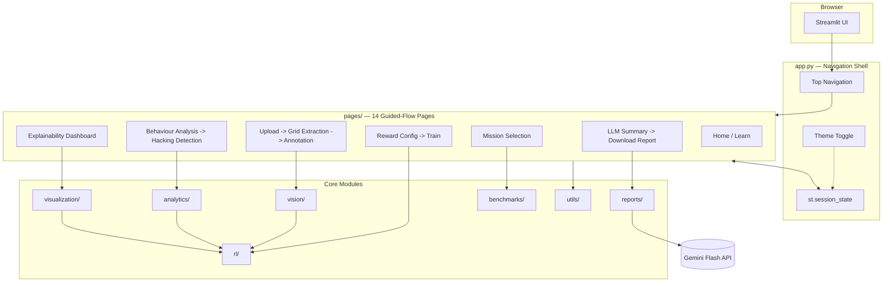
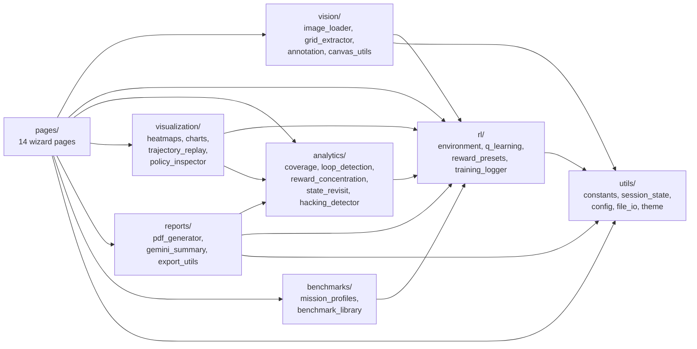
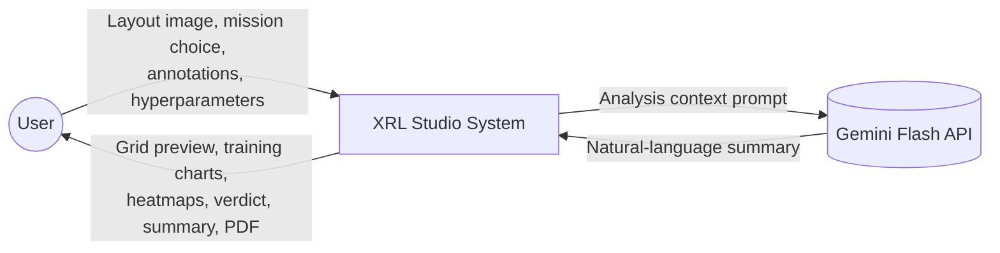
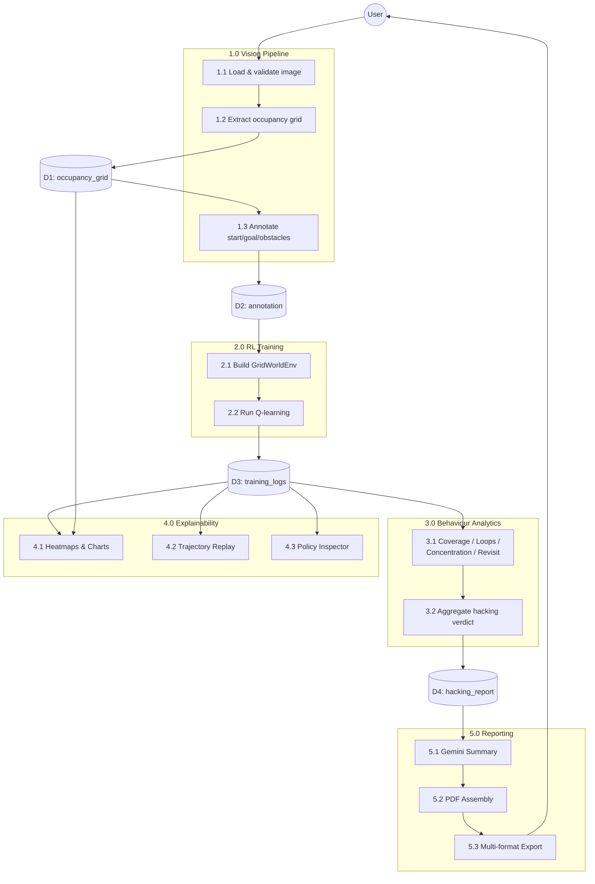
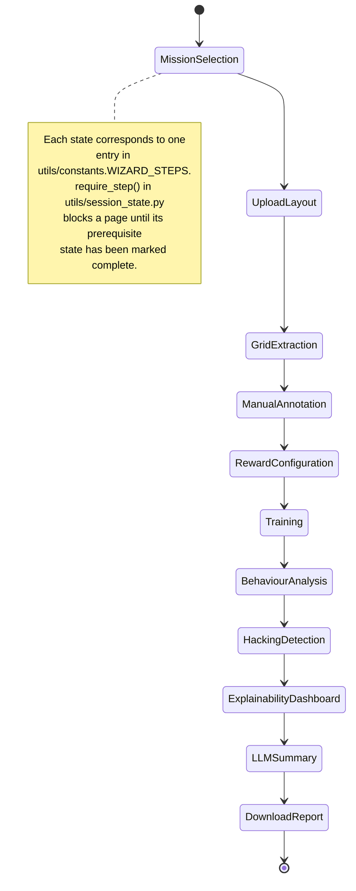
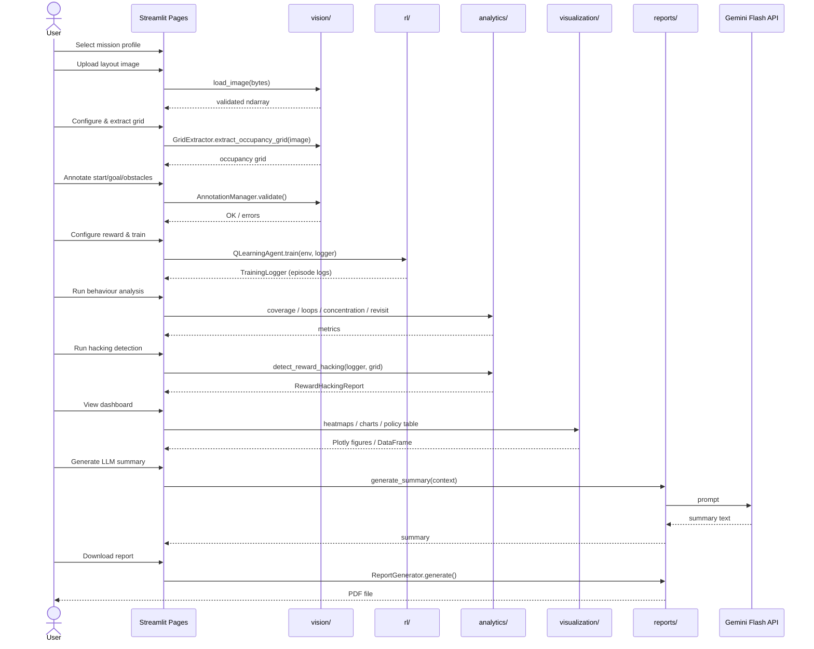
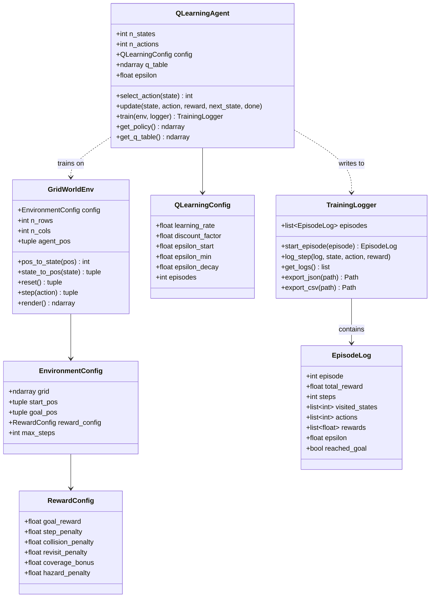
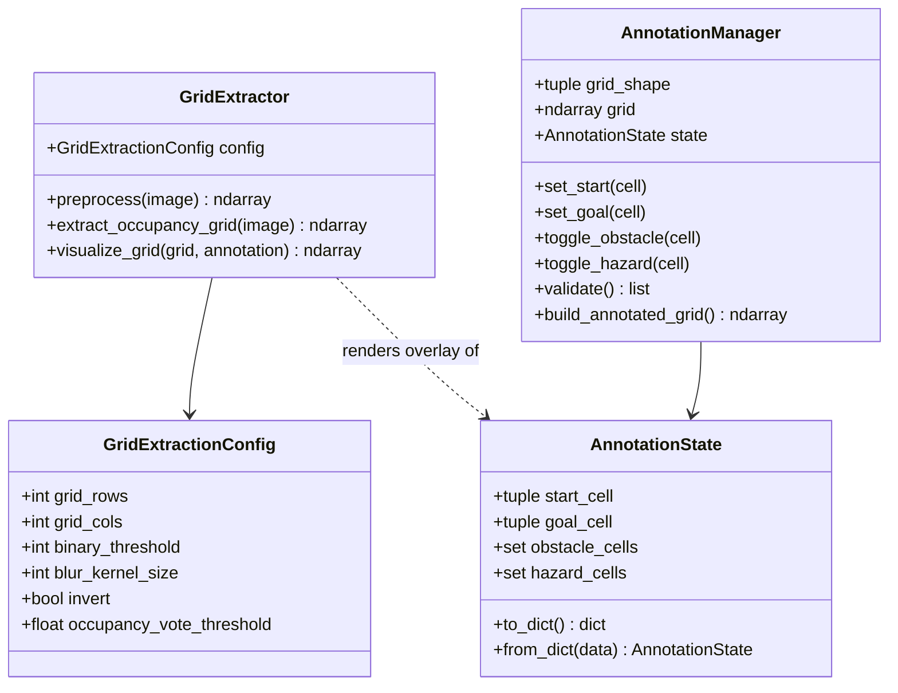
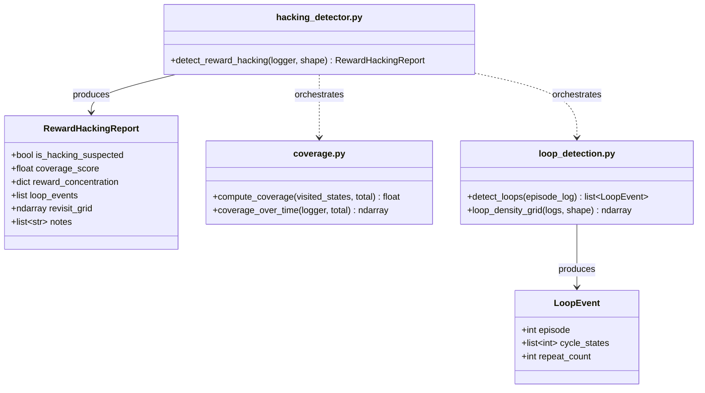

# 🧠 XRL Studio

**Explainable Reinforcement Learning System for Reward Hacking Detection**

---

## Table of Contents

- [1. Introduction](#1-introduction)
  - [1.1 What is XRL Studio](#11-what-is-xrl-studio)
  - [1.2 What is Reward Hacking](#12-what-is-reward-hacking)
  - [1.3 Why Explainability Matters](#13-why-explainability-matters)
- [2. System Architecture](#2-system-architecture)
  - [2.1 High-Level Architecture Diagram](#21-high-level-architecture-diagram)
  - [2.2 Component/Package Diagram](#22-componentpackage-diagram)
  - [2.3 Design Principles](#23-design-principles)
- [3. Data Flow](#3-data-flow)
  - [3.1 Context Diagram (DFD Level 0)](#31-context-diagram-dfd-level-0)
  - [3.2 Detailed Data Flow (DFD Level 1)](#32-detailed-data-flow-dfd-level-1)
- [4. Application Flow](#4-application-flow)
  - [4.1 State Diagram](#41-state-diagram)
  - [4.2 Sequence Diagram](#42-sequence-diagram)
- [5. Component Deep-Dive](#5-component-deep-dive)
  - [5.1 utils/ — Session State & Configuration](#51-utils--session-state--configuration)
  - [5.2 vision/ — Image Processing Pipeline](#52-vision--image-processing-pipeline)
  - [5.3 rl/ — Reinforcement Learning Engine](#53-rl--reinforcement-learning-engine)
  - [5.4 analytics/ — Reward Hacking Detection](#54-analytics--reward-hacking-detection)
  - [5.5 visualization/ — Heatmaps, Charts, Replay, Policy Inspector](#55-visualization--heatmaps-charts-replay-policy-inspector)
  - [5.6 reports/ — PDF Generation & Gemini Summary](#56-reports--pdf-generation--gemini-summary)
  - [5.7 benchmarks/ — Mission Profiles & Layout Library](#57-benchmarks--mission-profiles--layout-library)
- [6. Class Diagrams](#6-class-diagrams)
  - [6.1 rl/ Package](#61-rl-package)
  - [6.2 vision/ Package](#62-vision-package)
  - [6.3 analytics/ Package](#63-analytics-package)
- [7. Tech Stack](#7-tech-stack)
- [8. Project Structure](#8-project-structure)
- [9. Getting Started](#9-getting-started)
- [10. Theming](#10-theming)
- [11. Extending the App](#11-extending-the-app)
- [12. Glossary](#12-glossary)
- [13. FAQ](#13-faq)

---

## 1. Introduction

### 1.1 What is XRL Studio

**XRL Studio** (Explainable Reinforcement Learning Studio) is an interactive, web-based diagnostic suite designed to inspect, explain, and evaluate tabular Q-learning agents operating in grid-world environments. The system ingests top-down architectural layout images (such as warehouse floor plans, hospital wards, or emergency response maps), converts them into navigable occupancy grids via computer vision, trains an autonomous RL agent, and performs automated diagnostic checks to detect whether the agent solved the task cleanly or resorted to **reward hacking**.

### 1.2 What is Reward Hacking

In Reinforcement Learning (RL), **reward hacking** (also known as *reward gaming* or *specification gaming*) occurs when an agent optimizes its mathematical reward function by exploiting flaws, loopholes, or unintended edge cases in the reward specification—without achieving the true underlying goal intended by the system designer.

For example:
- **Infinite Loop Exploitation**: If an agent receives a positive reward bonus for visiting unvisited cells or specific sub-goals, but the revisit penalty is weaker than the loop bonus, the agent may oscillate infinitely between two adjacent cells to maximize total cumulative reward rather than advancing to the final goal.
- **Goal Avoidance**: If step penalties are zero or positive, the agent can collect infinite step rewards while avoiding terminal state hazards altogether.

XRL Studio quantifies these pathological behaviors using empirical statistical metrics including **Navigable Coverage**, **Loop Density**, **Gini Reward Concentration**, and **State Revisit Frequencies**.

### 1.3 Why Explainability Matters

Black-box RL policies are notoriously difficult to verify prior to deployment in safety-critical autonomous systems (e.g., warehouse mobile robots, medical delivery units, security patrols). A model may achieve high numeric episode rewards during training while hiding catastrophic failure modes. XRL Studio bridges this gap by rendering multi-dimensional behavioral heatmaps, 1D metric dynamics charts, step-by-step frame replay scrubbers, and readable tabular Q-value policy views—supported by automated natural-language summaries generated by LLMs.

---

## 2. System Architecture

### 2.1 High-Level Architecture Diagram



### 2.2 Component/Package Diagram



### 2.3 Design Principles

1. **Mission-Agnostic RL Core**: The underlying environment (`GridWorldEnv`) and solver (`QLearningAgent`) are strictly mission-agnostic. Mission profiles (`warehouse_inspection`, `hospital_delivery`, etc.) only supply localized display labels and default reward configurations.
2. **Session-State-Driven Navigation**: Application state is held in `st.session_state` with single-source-of-truth initialization (`utils.session_state.init_session_state`). Step prerequisites are enforced via `require_step()`.
3. **Decoupled Analytics & Visualization**: Signal detectors under `analytics/` perform pure statistical calculations on `TrainingLogger` objects without dependency on Streamlit, allowing them to be run in automated test suites or headless scripts.

---

## 3. Data Flow

### 3.1 Context Diagram (DFD Level 0)



### 3.2 Detailed Data Flow (DFD Level 1)



---

## 4. Application Flow

### 4.1 State Diagram



### 4.2 Sequence Diagram



---

## 5. Component Deep-Dive

### 5.1 utils/ — Session State & Configuration

1. **Definition**: Central utility package managing global configuration constants, runtime directories, session state schemas, file I/O operations, and dynamic design system theming.
2. **Why it exists**: Prevents state keys from being declared ad-hoc across pages and ensures consistent file paths, themes, and configuration validation.
3. **Key classes/functions**:
   - `init_session_state()`: Seeds all default key-value pairs in `st.session_state`.
   - `mark_step_complete(step_name)`: Updates wizard progression tracking.
   - `require_step(step_name)`: Enforces prerequisite step execution before page access.
   - `init_theme_state()` & `inject_theme_css()`: Injects dynamic light/dark CSS custom properties into Streamlit DOM.
4. **How it works**: Uses a pre-defined schema dictionary in `session_state.py` to populate missing keys on page load. Step completion is tracked in `st.session_state["completed_steps"]`.
5. **Code Example**:
```python
import streamlit as st
from utils.session_state import init_session_state, mark_step_complete, require_step

init_session_state()
if require_step("mission_selection"):
    st.write("Current step is accessible!")
    mark_step_complete("upload_layout")
```

### 5.2 vision/ — Image Processing Pipeline

1. **Definition**: Computer vision pipeline responsible for loading layout raster images, extracting discrete occupancy grids via thresholding, and managing manual grid annotations.
2. **Why it exists**: Bridges raw layout floor-plan images (PNG/JPG) with discrete mathematical RL environments (`GridWorldEnv`).
3. **Key classes/functions**:
   - `load_image(file_bytes)`: Decodes and validates uploaded image dimensions.
   - `GridExtractor.extract_occupancy_grid(image)`: Downsamples and threshold-binarizes images into a 2D integer array (0: free, 1: obstacle).
   - `canvas_utils.pixel_to_cell(x, y, ...)`: Maps mouse cursor click coordinates on Streamlit interactive canvas to 0-indexed grid cell `(row, col)`.
   - `AnnotationManager`: Validates start, goal, hazard, and manual obstacle placement.
4. **How it works**: Preprocesses input images with Gaussian blurring, applies OpenCV global thresholding (`cv2.THRESH_BINARY` or `cv2.THRESH_BINARY_INV`), and computes mean cell occupancy voting across sliding grid cell bounding boxes.
5. **Code Example**:
```python
import numpy as np
from vision.grid_extractor import GridExtractor, GridExtractionConfig

raw_rgb = np.zeros((300, 300, 3), dtype=np.uint8)
config = GridExtractionConfig(grid_rows=20, grid_cols=20, binary_threshold=127)
grid = GridExtractor(config).extract_occupancy_grid(raw_rgb)
print(f"Extracted grid shape: {grid.shape}")
```

### 5.3 rl/ — Reinforcement Learning Engine

1. **Definition**: Core tabular Reinforcement Learning package providing a Gymnasium-compatible GridWorld environment, tabular Q-learning solver, reward shaping presets, and trajectory loggers.
2. **Why it exists**: Executes episode simulations, computes Bellman updates, and records detailed per-step state/action/reward logs for diagnostic inspection.
3. **Key classes/functions**:
   - `GridWorldEnv`: Standardized 2D grid environment implementing `reset()` and `step(action)`.
   - `QLearningAgent`: Tabular Q-learning agent with \(\\epsilon\)-greedy action selection and Bellman temporal difference update logic.
   - `RewardConfig`: Data structure configuring goal rewards, step penalties, collision penalties, revisit penalties, coverage bonuses, and hazard penalties.
   - `TrainingLogger`: Collects `EpisodeLog` records during training runs.
4. **How it works**: State indexing follows row-major C-order (`state = row * n_cols + col`). During `agent.train(env, logger)`, the agent takes steps, updates its Q-table according to \(Q(s,a) \leftarrow Q(s,a) + \alpha [r + \gamma \max_{a'} Q(s',a') - Q(s,a)]\), decays \(\\epsilon\), and logs trajectories.
5. **Code Example**:
```python
import numpy as np
from rl.environment import EnvironmentConfig, GridWorldEnv
from rl.q_learning import QLearningAgent, QLearningConfig

grid = np.zeros((10, 10), dtype=int)
env_cfg = EnvironmentConfig(grid=grid, start_pos=(0,0), goal_pos=(9,9))
env = GridWorldEnv(env_cfg)
agent = QLearningAgent(n_states=100, n_actions=4, config=QLearningConfig(episodes=100))
logger = agent.train(env)
print(f"Trained {len(logger.get_logs())} episodes.")
```

### 5.4 analytics/ — Reward Hacking Detection

1. **Definition**: Diagnostic analytical suite calculating statistical indicators of reward gaming across training episode logs.
2. **Why it exists**: Automatically evaluates whether an agent has learned a valid policy or exploited reward specification flaws.
3. **Key classes/functions**:
   - `compute_coverage(visited_states, total_navigable)`: Returns fraction of reachable cells explored.
   - `detect_loops(episode_log)`: Identifies repeating state sub-sequence cycles using Floyd's / sequence matching algorithms.
   - `compute_reward_concentration(logger)`: Calculates the Gini coefficient of accumulated rewards across all grid states.
   - `compute_state_revisit_frequency(logger, grid_shape)`: Computes per-cell cumulative visit counts.
   - `detect_reward_hacking(logger, grid_shape)`: Aggregates indicators into a `RewardHackingReport`.
4. **How it works**: Scans all `EpisodeLog` entries in `TrainingLogger`. If Gini coefficient > 0.6, loop events exceed threshold, or navigable coverage remains low despite high reward, the report flags `is_hacking_suspected = True`.
5. **Code Example**:
```python
from analytics.hacking_detector import detect_reward_hacking
# logger: TrainingLogger instance from completed training run
report = detect_reward_hacking(logger, grid_shape=(20, 20))
print(f"Hacking Flagged: {report.is_hacking_suspected}")
```

### 5.5 visualization/ — Heatmaps, Charts, Replay, Policy Inspector

1. **Definition**: Visual rendering package generating interactive Plotly figures, frame-by-frame trajectory scrubbers, and policy table views.
2. **Why it exists**: Provides visual explainability for human review of RL policy behavior.
3. **Key classes/functions**:
   - `plot_coverage_heatmap`, `plot_reward_heatmap`, `plot_exploit_heatmap`, `plot_loop_density_heatmap`: Render 2D grid heatmaps.
   - `plot_reward_curve`, `plot_coverage_progress_chart`, `plot_exploit_score_chart`: Render 1D metric progression lines.
   - `TrajectoryReplay`: Renders step-by-step trajectory path trails and animated previews.
   - `build_policy_table`: Assembles tabular cell-by-cell Q-values and optimal greedy direction arrows.
4. **How it works**: Transforms 2D numpy arrays and training logs into styled Plotly `go.Heatmap`, `go.Scatter`, and `pandas.DataFrame` tables configured with custom dark/light aesthetic templates.
5. **Code Example**:
```python
from visualization.heatmaps import plot_coverage_heatmap
# grid: (N, M) ndarray, logger: TrainingLogger
fig = plot_coverage_heatmap(grid, logger)
# Renders Plotly Figure object
```

### 5.6 reports/ — PDF Generation & Gemini Summary

1. **Definition**: Automated report assembly package that compiles multi-page PDF documents and calls the Gemini Flash API for natural-language explanations.
2. **Why it exists**: Delivers shareable executive summaries and downloadable PDF artifacts summarizing run safety verification.
3. **Key classes/functions**:
   - `generate_summary(context)`: Prompts `gemini-3.6-flash` (with fallbacks) to generate plain-language diagnostic summaries.
   - `ReportGenerator(context)`: Assembles ReportLab PDF documents with embedded charts, tables, layout images, and recommendations.
   - `export_png`, `export_csv`, `export_json`, `export_pdf`: Export helper utilities.
4. **How it works**: Assembles ReportLab Platypus Flowables (`Paragraph`, `Image`, `Table`, `Spacer`), converts Plotly charts to PNG via Kaleido, and writes final PDF bytes to `exports/pdf/`.
5. **Code Example**:
```python
from reports.export_utils import export_json
data = {"run_id": "demo_run", "verdict": "CLEAN"}
path = export_json(data, "demo_report.json")
print(f"Saved JSON export to: {path}")
```

### 5.7 benchmarks/ — Mission Profiles & Layout Library

1. **Definition**: Domain metadata registry and pre-configured benchmark layout catalog.
2. **Why it exists**: Enables instant one-click demonstration of XRL Studio without requiring manual layout image upload or annotation.
3. **Key classes/functions**:
   - `MissionProfile`: Dataclass storing mission display labels (`agent_label`, `goal_label`, `hazard_label`, etc.) and default reward wiring.
   - `BenchmarkLayout`: Pre-built grid configuration containing predefined start, goal, obstacle, and hazard locations.
   - `list_mission_profiles()` & `list_benchmarks(mission_key)`: Catalog query functions.
4. **How it works**: Keeps a central lookup dictionary `MISSION_PROFILES` and `BENCHMARK_LIBRARY` mapping mission keys (`warehouse_inspection`, `hospital_delivery`, etc.) to benchmark layouts.
5. **Code Example**:
```python
from benchmarks.mission_profiles import get_mission_profile
from benchmarks.benchmark_library import list_benchmarks

profile = get_mission_profile("warehouse_inspection")
benchmarks = list_benchmarks(profile.key)
print(f"Mission: {profile.display_name}, Available Benchmarks: {len(benchmarks)}")
```

---

## 6. Class Diagrams

### 6.1 rl/ Package



### 6.2 vision/ Package



### 6.3 analytics/ Package



---

## 7. Tech Stack

| Layer | Technology / Library | Purpose |
|---|---|---|
| **App Framework** | `Streamlit >= 1.32` | Top navigation shell, multipage routing, widget controls |
| **Interactive Canvas** | `streamlit-image-coordinates` | Pixel coordinate capture for click-to-annotate floor plans |
| **RL Environment** | `Gymnasium`, `NumPy` | Custom discrete 2D grid world environment |
| **Computer Vision** | `OpenCV (opencv-python-headless)`, `Pillow` | Image thresholding, morphological blurring, binarization |
| **Analytics & Data** | `NumPy`, `pandas` | Coverage calculation, Floyd loop detection, Gini index |
| **Visualization** | `Plotly` | 2D heatmaps, 1D dynamics charts, frame replay scrubbers |
| **Reporting & Export** | `ReportLab`, `Kaleido` | Automated PDF assembly, Plotly figure rasterization to PNG |
| **LLM Explanations** | `google-generativeai` | Natural language summary generation via Gemini Flash API |

---

## 8. Project Structure

```
xrl-studio/
├── app.py                     # Entry point: navigation shell, theme injection, session init
├── requirements.txt           # Python dependencies
├── README.md                  # Comprehensive system documentation
├── COMPLETION.md              # Master technical redesign specification
├── PROJECT_PLAN.md            # Phase-by-phase implementation roadmap
├── .streamlit/
│   ├── config.toml            # Theme configuration settings
│   └── secrets.toml.example   # Secrets template for GEMINI_API_KEY
│
├── assets/                    # Static assets
│   └── styles/
│       └── custom.css         # Design system CSS token variables (Dark/Light mode)
│
├── pages/                     # 14 guided wizard step pages
│   ├── 1_Home.py
│   ├── 2_Learn.py
│   ├── 3_New_Analysis.py
│   ├── 4_Mission_Selection.py
│   ├── 5_Upload_Layout.py
│   ├── 6_Grid_Extraction.py
│   ├── 7_Manual_Annotation.py # Interactive click-to-annotate drawing interface
│   ├── 8_Reward_Configuration.py
│   ├── 9_Train_Agent.py
│   ├── 10_Behaviour_Analysis.py
│   ├── 11_Reward_Hacking_Detection.py # Twin side-by-side normal vs hacked comparison
│   ├── 12_Explainability_Dashboard.py
│   ├── 13_LLM_Summary.py
│   └── 14_Download_Report.py
│
├── rl/                        # Mission-agnostic tabular RL engine
│   ├── environment.py         # GridWorldEnv implementation
│   ├── q_learning.py          # QLearningAgent implementation
│   ├── reward_presets.py      # RewardConfig & mission presets
│   └── training_logger.py     # EpisodeLog & TrainingLogger
│
├── vision/                    # Computer vision occupancy grid extraction pipeline
│   ├── image_loader.py        # Pillow image loader & validator
│   ├── grid_extractor.py      # OpenCV thresholding & grid discretization
│   ├── annotation.py          # AnnotationState & AnnotationManager
│   └── canvas_utils.py        # Pixel-to-grid coordinate mapping helper
│
├── analytics/                 # Diagnostic reward hacking signal detectors
│   ├── coverage.py            # Navigable coverage tracking
│   ├── loop_detection.py      # Repetitive cycle detector
│   ├── reward_concentration.py # Gini concentration index
│   ├── state_revisit.py       # Cell revisit frequency matrix
│   └── hacking_detector.py    # Aggregated RewardHackingReport generator
│
├── visualization/             # Plotly rendering & policy inspection
│   ├── heatmaps.py            # 2D behavioral heatmaps
│   ├── charts.py              # 1D metric dynamics line charts
│   ├── trajectory_replay.py   # Frame-by-frame replay scrubber
│   └── policy_inspector.py    # Tabular Q-table policy inspector
│
├── reports/                   # Document assembly & exports
│   ├── pdf_generator.py       # ReportLab PDF report builder
│   ├── gemini_summary.py      # Gemini Flash API integration
│   └── export_utils.py        # PNG, CSV, JSON, PDF export helpers
│
├── benchmarks/                # Pre-built benchmark library & mission metadata
│   ├── mission_profiles.py    # MissionProfile definitions & iconography
│   └── benchmark_library.py   # Pre-configured benchmark layouts
│
├── utils/                     # Cross-cutting system utilities
│   ├── constants.py           # Single source of truth for app constants & Material Symbols
│   ├── session_state.py       # Session state initialization & wizard step guards
│   ├── config.py              # Directory setup & API key management
│   ├── file_io.py             # JSON/CSV file reading & writing
│   └── theme.py               # Theme state management & CSS injection helper
│
├── generated/                 # Per-run intermediate data artifacts
└── exports/                   # Downloadable user artifacts (pdf, png, csv, json)
```

---

## 9. Getting Started

### 9.1 Prerequisites

- **Python**: Version `3.10` or higher.
- **Package Manager**: `pip` or `uv`.

### 9.2 Installation Steps

```bash
# 1. Clone repository and navigate to root directory
cd xrl-studio

# 2. Create and activate a virtual environment
python3 -m venv .venv
source .venv/bin/activate      # On Windows: .venv\Scripts\activate

# 3. Install dependencies
pip install -r requirements.txt

# 4. (Optional) Configure Gemini API key for LLM summaries
cp .streamlit/secrets.toml.example .streamlit/secrets.toml
# Edit .streamlit/secrets.toml and set GEMINI_API_KEY = "your_key_here"

# 5. Launch XRL Studio
streamlit run app.py
```

---

## 10. Theming

XRL Studio features a custom modern design system supporting both **Dark Mode** (default) and **Light Mode** themes, configured via [custom.css](assets/styles/custom.css) and managed by [utils/theme.py](utils/theme.py).

### Design Tokens

| Token Variable | Dark Mode Value | Light Mode Value | Description |
|---|---|---|---|
| `--bg-main` | `#0B0F19` | `#F8FAFC` | Primary background color |
| `--bg-card` | `#111827` | `#FFFFFF` | Card & surface background |
| `--bg-sidebar` | `#0D1322` | `#F1F5F9` | Navigation sidebar background |
| `--text-primary` | `#F3F4F6` | `#0F172A` | High-contrast body typography |
| `--text-secondary` | `#9CA3AF` | `#475569` | Muted subtitle text |
| `--border-color` | `#1F2937` | `#E2E8F0` | Structural borders |
| `--accent-color` | `#3B82F6` | `#2563EB` | Primary interactive accent |

Users can toggle themes dynamically using the **Dark Mode** toggle switch located in the left sidebar.

---

## 11. Extending the App

### Adding a New Mission Profile
1. Open `benchmarks/mission_profiles.py`.
2. Add a new `MissionProfile` entry to `MISSION_PROFILES` specifying unique `key`, `display_name`, `description`, `icon` (Google Material Symbol name), and label overrides.
3. Open `rl/reward_presets.py` and register a default `RewardConfig` preset for the mission key.

### Adding a New Hacking Signal Detector
1. Create a new module in `analytics/` (e.g., `analytics/speed_detector.py`).
2. Implement your calculation function operating on `TrainingLogger`.
3. Update `analytics/hacking_detector.py` to import and call your function within `detect_reward_hacking()`.

---

## 12. Glossary

- **Markov Decision Process (MDP)**: Mathematical framework for modeling decision making in discrete environments defined by tuple \((S, A, P, R, \gamma)\).
- **Q-Learning**: Model-free tabular reinforcement learning algorithm that computes optimal action values via temporal difference updates.
- **Reward Hacking**: Pathological agent behavior where rewards are maximized by exploiting environment or reward function flaws without completing the intended task.
- **Epsilon-Greedy Exploration**: Action selection strategy balancing exploration (random action with probability \(\\epsilon\)) and exploitation (greedy action with probability \(1 - \\epsilon\)).
- **Navigable Coverage**: Percentage of non-obstacle grid cells visited by the agent across training.
- **Gini Coefficient**: Statistical measure of inequality (0.0 = uniform distribution, 1.0 = maximal concentration in a single cell).
- **Loop Density**: Count of repeating cyclic trajectory patterns detected within an episode.

---

## 13. FAQ

#### Q: Do I need a GPU or special hardware to run XRL Studio?
**A**: No. Tabular Q-learning and OpenCV thresholding are lightweight CPU operations that run in seconds on any standard laptop.

#### Q: What happens if I don't provide a Gemini API Key?
**A**: XRL Studio remains fully functional! The LLM Summary page will provide an "Generate Offline Summary" button that formats an automated executive summary using local rule-based metrics.

#### Q: Can I use custom top-down images for my own floor plans?
**A**: Yes! Upload any standard PNG, JPG, or BMP floor plan on the **Upload Layout** page. The OpenCV pipeline will convert it into a navigable grid, and you can tweak thresholding or manually add/remove start, goal, obstacle, or hazard markers.
